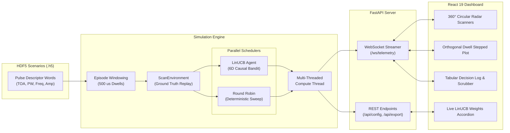
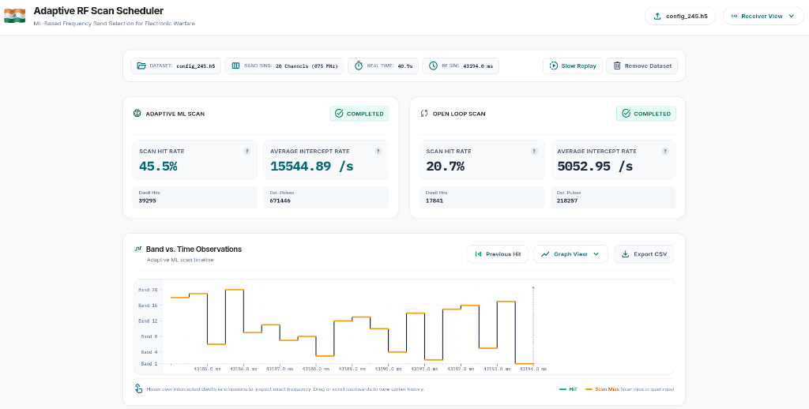

<div align="center">

# 🛰️ RF-Smart-Scheduler ⚡
### Cognitive Frequency Band Scheduler for Electronic Warfare (EW) & Radar Warning Receivers (RWR)

[](https://www.sih.gov.in/)
[](https://www.python.org/)
[](https://fastapi.tiangolo.com/)
[](https://react.dev/)
[](https://vitejs.dev/)
[](https://tailwindcss.com/)
[](https://developer.mozilla.org/en-US/docs/Web/API/WebSockets_API)
[](https://arxiv.org/abs/1003.0146)
[](https://docs.pytest.org/)

<br/>

```text
┌────────────────────────────────────────────────────────────────────────────────────────┐
│   0.5 GHz                                18.0 GHz Spectrum                             │
│   [Band 1] [Band 2] [Band 3]  ...  [Band 18] [Band 19] [Band 20]                       │
│      └─► 20 Channels × 875 MHz  │  500 µs Dwell Interval  │  Zero Prior Intelligence   │
└────────────────────────────────────────────────────────────────────────────────────────┘
```

<p align="center">
  <b>An adaptive AI-driven RF scanner that outsmarts frequency-agile radar emitters in real-time.</b>
</p>

---

</div>

## 📑 Table of Contents
- [📌 Executive Overview](#-executive-overview)
- [🥊 Open-Loop vs. Cognitive Bandit Comparison](#-open-loop-vs-cognitive-bandit-comparison)
- [🌟 Key Capabilities & Features](#-key-capabilities--features)
- [🛠️ Technology Stack](#️-technology-stack)
- [📊 20-Channel RF Spectrum Discretization](#-20-channel-rf-spectrum-discretization)
- [🧠 Algorithmic & Mathematical Foundation](#-algorithmic--mathematical-foundation)
  - [1. 6D Causal Context Vector](#1-6d-causal-context-vector-mathbff_ta)
  - [2. Ridge Regression & Upper Confidence Bound](#2-ridge-regression--upper-confidence-bound)
  - [3. Multi-Objective EW Reward Function](#3-multi-objective-ew-reward-function)
- [🏗️ System Architecture](#️-system-architecture)
- [📁 Repository Structure](#-repository-structure)
- [🚀 Local Installation & Quickstart](#-local-installation--quickstart)
  - [Prerequisites](#prerequisites)
  - [Backend Setup (FastAPI + LinUCB)](#step-1-backend-setup-fastapi--linucb)
  - [Frontend Setup (React 19 + Vite)](#step-2-frontend-setup-react-19--vite)
- [🕹️ Application Workflow & Dashboard Guide](#️-application-workflow--dashboard-guide)
- [📡 API & WebSocket Reference](#-api--websocket-reference)
- [🧪 Testing & Verification](#-testing--verification)
- [🔬 Model Training & Evaluation Pipeline](#-model-training--evaluation-pipeline)
- [🤝 Acknowledgements & Attribution](#-acknowledgements--attribution)

---

## 📌 Executive Overview

Modern Electronic Support Measures (**ESM**), Radar Warning Receivers (**RWR**), and Electronic Intelligence (**ELINT**) systems face an intrinsic physical limitation: **monitoring wideband electromagnetic environments ($0.50\,\text{GHz}$ to $18.00\,\text{GHz}$) using narrowband digital receivers with limited instantaneous bandwidth (IBW)**.

```text
┌─────────────────────────────────────────────────────────────────────────────────────────────┐
│ 🔴 THE PROBLEM: Open-Loop Round-Robin Cycling                                               │
│ Receivers sweep through bands 1 to 20 sequentially. If an agile threat emits on Band 14     │
│ right after the receiver leaves it, the system must wait 10 ms (19 dwells) before checking │
│ again. Result: High acquisition delay, pulse loss, and catastrophic blind spots.            │
├─────────────────────────────────────────────────────────────────────────────────────────────┤
│ 🟢 THE SOLUTION: RF-Smart-Scheduler (Cognitive Bandit)                                      │
│ Models band scheduling as a Contextual Multi-Armed Bandit (LinUCB) with adaptive coverage. │
│ Dynamically allocates 500 µs dwell windows based strictly on causal observation history.   │
│ Result: Sub-millisecond threat interception, zero blind spots, and provable coverage.       │
└─────────────────────────────────────────────────────────────────────────────────────────────┘
```

**RF-Smart-Scheduler** eliminates dependence on prior intelligence. It does **not** need to know emitter IDs, pulse repetition intervals (PRI), antenna scan schedules, or mission scenarios. It discovers and tracks active emitters purely through causal observation statistics.

---

## 🥊 Open-Loop vs. Cognitive Bandit Comparison

| Operational Metric | Open-Loop (Round Robin) | Adaptive ML (LinUCB Scheduler) | Advantage Status |
|:---|:---:|:---:|:---:|
| **Dwell Allocation Strategy** | Rigid, Sequential ($1 \to 2 \dots \to 20$) | Contextual Ridge Regression + UCB |  |
| **First-Intercept Acquisition Delay** | High ($5\text{–}10\,\text{ms}$ average) | Substantially Lower (Rapid Re-visit) |  |
| **Frequency-Agile Radar Tracking** | Blind between sweeps | High Probability of Intercept ($P_i$) |  |
| **Band Coverage Guarantee** | 100% Deterministic ($10\,\text{ms}$) | Hard Overdue Revisit Constraints |  |
| **Prior Emitter Intelligence Required** | None | **Zero** (Purely Causal Signals) |  |
| **Exploration Mechanism** | None (Blind Sweep) | Upper-Confidence Bound + Urgency |  |

---

## 🌟 Key Capabilities & Features

<div align="center">

| Feature | Description | Status |
|:---|:---|:---:|
| **Contextual Bandit Engine** | Recursive closed-form LinUCB updates ($O(d^2)$ complexity) |  |
| **Dual Radar Scanners** | Twin 360° circular vector radar scopes (Adaptive vs. Round Robin) |  |
| **Dual Viewpoints** | Seamlessly toggle between **Receiver View** and **Environment Truth** |  |
| **Stepped Dwell Graph** | Orthogonal dwell transition graph showing frequency jumps across time |  |
| **Time Machine Scrubber** | Pause, scrub, and inspect any single dwell across 100,000+ time slices |  |
| **Live Bandit Diagnostics** | Real-time accordion displaying learned feature weights $\hat{\boldsymbol{\theta}}$ |  |
| **HDF5 Ingestion** | Drag-and-drop ingestion of standard Pulse Descriptor Word (.h5) files |  |
| **Full CSV Export** | Instant download of every dwell decision, frequency, and intercepted pulse |  |

</div>

---

## 🛠️ Technology Stack

<div align="center">

### Core Machine Learning & Scientific Computing
[](https://www.python.org/)
[](https://numpy.org/)
[-276DC3?style=for-the-badge&logo=hdf5&logoColor=white)](https://www.h5py.org/)
[](https://pyyaml.org/)
[](https://huggingface.co/)

### Backend REST & Real-Time Streaming
[](https://fastapi.tiangolo.com/)
[](https://www.uvicorn.org/)
[](https://websockets.readthedocs.io/)
[](https://docs.pydantic.dev/)
[](https://docs.pytest.org/)

### Frontend UI & High-Fidelity Visualizations
[](https://react.dev/)
[](https://vitejs.dev/)
[](https://tailwindcss.com/)
[](https://developer.mozilla.org/en-US/docs/Web/SVG)

</div>

---

## 📊 20-Channel RF Spectrum Discretization

The system partitions the spectrum between **500 MHz and 18.0 GHz** into 20 non-overlapping channels ($875\,\text{MHz}$ each). Tuner dwell duration is fixed at $\Delta t_{\text{dwell}} = 500\,\mu\text{s}$:

| Band | Frequency Range | Center | Radar Band Type | Tactical Function | Status |
|:---:|:---:|:---:|:---:|:---|:---:|
| **1** | `0.50 – 1.38 GHz` | `0.94 GHz` |  | UHF / L-Band Early Warning Radar |  |
| **2** | `1.38 – 2.25 GHz` | `1.81 GHz` |  | L-Band Air Surveillance Radar |  |
| **3** | `2.25 – 3.13 GHz` | `2.69 GHz` |  | S-Band En-Route Air Traffic Radar |  |
| **4** | `3.13 – 4.00 GHz` | `3.56 GHz` |  | S-Band 3D Phased Array Target Acquisition |  |
| **5** | `4.00 – 4.88 GHz` | `4.44 GHz` |  | C-Band Weather & Altitude Detection |  |
| **6** | `4.88 – 5.75 GHz` | `5.31 GHz` |  | C-Band Multifunction Battlefield Radar |  |
| **7** | `5.75 – 6.63 GHz` | `6.19 GHz` |  | C-Band Medium-Range Air Defense Radar |  |
| **8** | `6.63 – 7.50 GHz` | `7.06 GHz` |  | Airborne Early Warning & Control (AEW&C) |  |
| **9** | `7.50 – 8.38 GHz` | `7.94 GHz` |  | Military Satcom Uplinks / Telemetry |  |
| **10** | `8.38 – 9.25 GHz` | `8.81 GHz` |  | X-Band Marine Navigation & Surface Search |  |
| **11** | `9.25 – 10.13 GHz` | `9.69 GHz` |  | X-Band Airborne Interceptor / Fire Control |  |
| **12** | `10.13 – 11.00 GHz` | `10.56 GHz` |  | X-Band Surface Missile Illuminator / Guidance |  |
| **13** | `11.00 – 11.88 GHz` | `11.44 GHz` |  | Ku-Band Tactical Unmanned Data Link |  |
| **14** | `11.88 – 12.75 GHz` | `12.31 GHz` |  | Ku-Band Synthetic Aperture Radar (SAR) |  |
| **15** | `12.75 – 13.63 GHz` | `13.19 GHz` |  | Ku-Band Precision Weapon Terminal Seeker |  |
| **16** | `13.63 – 14.50 GHz` | `14.06 GHz` |  | High-Band Sensor Pod & Target Pod Uplink |  |
| **17** | `14.50 – 15.38 GHz` | `14.94 GHz` |  | Ku-Band Reconnaissance Battlefield Radar |  |
| **18** | `15.38 – 16.25 GHz` | `15.81 GHz` |  | EW Frequency-Agility Noise / Deception Jammer |  |
| **19** | `16.25 – 17.13 GHz` | `16.69 GHz` |  | Active EW Chirp Countermeasures |  |
| **20** | `17.13 – 18.00 GHz` | `17.56 GHz` |  | K-Band High-Resolution Target Tracking |  |

---

## 🧠 Algorithmic & Mathematical Foundation

```text
       ┌────────────────────────┐
       │ Causal Observations    │
       │ (Dwell History, Hits)  │
       └───────────┬────────────┘
                   │
                   ▼
       ┌────────────────────────┐
       │ 6D Feature Vector x_ta │
       └───────────┬────────────┘
                   │
         ┌─────────┴─────────┐
         ▼                   ▼
┌──────────────────┐ ┌──────────────────┐
│ Expected Reward  │ │ Epistemic Bound  │
│ x_ta^T * theta   │ │ alpha * sqrt(...)│
└────────┬─────────┘ └────────┬─────────┘
         │                    │
         └─────────┬──────────┘
                   ▼
       ┌────────────────────────┐
       │ Hard Overdue Constraint│
       │ Delta t > tau_max ?    │
       └───────────┬────────────┘
                   │
                   ▼
          [ Selected Band a* ]
```

### 1. 6D Causal Context Vector ($\mathbf{x}_{t,a}$)

For each candidate band $a \in \{1, \dots, 20\}$ at dwell $t$, the context vector $\mathbf{x}_{t,a} \in \mathbb{R}^6$ is computed strictly from prior receiver observations:

| Feature Index | Feature Name | Description & Formula | Value Representation |
|:---:|:---|:---|:---:|
| `x[0]` |  | Baseline model intercept | Constant `1.0` |
| `x[1]` |  | Normalized time since band $a$ was last visited: $\frac{t - t_{\text{last}}(a)}{\tau_{\max}}$ | $[0.0, 1.0]$ |
| `x[2]` |  | Exponentially Weighted Moving Average of pulse detections ($\alpha = 0.2$) | $[0.0, 1.0]$ |
| `x[3]` |  | Log-scaled pulse count from most recent visit: $\log(1 + N_{\text{pulses}})$ | $[0.0, \infty)$ |
| `x[4]` |  | Counter of sequential dwells with zero intercepted pulses | $[0.0, \infty)$ |
| `x[5]` |  | Autocorrelation of recurring hits (inferred emitter rotation cycle) | $[0.0, 1.0]$ |

> [!NOTE]
> Emitter IDs, classes, PRIs, and future ground-truth activities are **strictly excluded** from context vectors. The scheduler operates solely as a causal cognitive agent.

### 2. Ridge Regression & Upper Confidence Bound

The algorithm maintains an inverse covariance matrix $\mathbf{A}_a^{-1} \in \mathbb{R}^{6 \times 6}$ and reward history vector $\mathbf{b}_a \in \mathbb{R}^6$ for each band:

$$\hat{\boldsymbol{\theta}}_a = \mathbf{A}_a^{-1} \mathbf{b}_a$$

At each step, the scheduler evaluates the Upper Confidence Bound:

$$\text{Score}_t(a) = \underbrace{\mathbf{x}_{t,a}^\top \hat{\boldsymbol{\theta}}_a}_{\text{Exploitation: Expected Reward}} + \underbrace{\alpha \sqrt{\mathbf{x}_{t,a}^\top \mathbf{A}_a^{-1} \mathbf{x}_{t,a}}}_{\text{Exploration: Uncertainty Bonus}} + \underbrace{U_{\text{coverage}}(a)}_{\text{Starvation Guard}}$$

- **Hard Revisit Constraint**: If $\Delta t_{\text{last}}(a) \ge \tau_{\max}$, band $a$ is immediately prioritized, preventing emitter starvation and enforcing periodic spectrum sweeps.
- **Fast Closed-Form Updates**: Covariances are updated in $O(d^2)$ via the Sherman-Morrison rank-1 update formula, achieving $>50,000$ decisions/second.

### 3. Multi-Objective EW Reward Function

Offline training and online evaluation optimize a balanced multi-objective electronic warfare objective:

$$R_t = \underbrace{w_{\text{hit}} \cdot N_{\text{pulses}}(t)}_{\text{Pulse Intercept Reward}} - \underbrace{w_{\text{delay}} \cdot N_{\text{pending}}(t) \cdot \Delta t_{\text{dwell}}}_{\text{First-Intercept Delay Penalty}} - \underbrace{w_{\text{miss}} \cdot I_{\text{miss}}(t) \cdot \Delta t_{\text{dwell}}}_{\text{Action-Level Miss Penalty}}$$

- : Reward earned per successfully intercepted radar pulse.
- : Cost per second for every active radar emitter that has not yet been discovered.
-  ($0.01$ per $500\,\mu\text{s}$ dwell): Cost incurred when spectrum emissions were present but the chosen band caught zero.

---

## 🏗️ System Architecture



---

## 📁 Repository Structure

```text
RF-Smart-Scheduler/
├── README.md                           # Comprehensive documentation (this file)
├── backend/                            # High-performance FastAPI backend & simulation
│   ├── main.py                         # Backend entrypoint (Uvicorn server)
│   ├── scheduler_engine.py             # Engine compatibility & facade layer
│   ├── benchmark_speed.py              # Hardware execution speed benchmark
│   ├── config_1.h5                     # Sample evaluation scenario (HDF5 format)
│   ├── requirements.txt                # Python backend dependencies
│   ├── app/                            # Modular FastAPI application package
│   │   ├── main.py                     # App factory, routers, and CORS middleware
│   │   ├── core/                       # Configurations, constants, Pydantic schemas
│   │   │   ├── config.py               # 20 Spectrum bands, dwell timings, paths
│   │   │   └── models.py               # Request and response schemas
│   │   ├── api/                        # Route definitions
│   │   │   ├── routes/                 # Telemetry, bands, dataset, and config routes
│   │   │   └── websockets/             # Real-time WebSocket streaming handlers
│   │   └── services/                   # Business logic and simulation
│   │       ├── simulation_engine.py    # Dual scheduler simulation & thread worker
│   │       ├── dataset_service.py      # HDF5 pulse parsing & dwell windowing
│   │       └── benchmark_service.py    # Multi-dwell comparative benchmarking
│   ├── model/                          # Smart Scan research package (smart_scan)
│   │   ├── pyproject.toml              # Model package definitions
│   │   ├── configs/                    # YAML scenario & bandit configurations
│   │   ├── artifacts/                  # Frozen LinUCB model checkpoints (.npz)
│   │   ├── scripts/                    # Training, evaluation, and test scripts
│   │   ├── src/smart_scan/             # Core ML algorithms, LinUCB, features, FOM
│   │   └── tests/                      # Model algorithmic test suite (29 tests)
│   ├── tests/                          # Backend API & WebSocket integration tests (15 tests)
│   └── uploads/                        # Dynamic storage for uploaded .h5 datasets
└── frontend/                           # React 19 + Vite + Tailwind CSS frontend
    ├── package.json                    # Node dependencies and scripts
    ├── vite.config.js                  # Vite configuration & Tailwind plugin
    ├── index.html                      # Single page application entrypoint
    ├── public/                         # Public assets (flags, icons)
    └── src/                            # React application source code
        ├── main.jsx                    # React DOM root render
        ├── App.jsx                     # Main dashboard container & state orchestrator
        ├── index.css                   # Tailwind CSS root stylesheet & animations
        ├── components/                 # UI components
        │   ├── Header.jsx              # Status, controls, upload, view toggle
        │   ├── RadarScanner.jsx        # Dual circular 360° radar sweep visualizers
        │   ├── ObservationsSection.jsx # Stepped trajectory graph & dwell log table
        │   ├── RLParametersAccordion.jsx# Live LinUCB theta weights and parameters
        │   └── Toast.jsx               # Feedback notifications
        └── services/
            └── telemetryService.js     # WebSocket connection & REST client
```

---

## 🚀 Local Installation & Quickstart

### Prerequisites
Make sure your development machine has the following tools installed:
- 
- 
- 
- 

---

### Step 1: Backend Setup (FastAPI + LinUCB)

```bash
# 1. Clone the repository
git clone https://github.com/<your-username>/RF-Smart-Scheduler.git
cd RF-Smart-Scheduler/backend

# 2. Create and activate a Python virtual environment
python3 -m venv .venv

# On Linux / macOS:
source .venv/bin/activate
# On Windows (PowerShell):
# .\.venv\Scripts\Activate.ps1

# 3. Install dependencies (includes editable smart_scan model package)
pip install --upgrade pip
pip install -r requirements.txt

# 4. Start the FastAPI backend server
python main.py
```

> The backend will launch at **`http://localhost:8000`**.
> Explore the interactive OpenAPI docs at **`http://localhost:8000/docs`**.

---

### Step 2: Frontend Setup (React 19 + Vite)

Open a **separate terminal** window:

```bash
# 1. Navigate to the frontend directory
cd RF-Smart-Scheduler/frontend

# 2. Install Node dependencies
npm install

# 3. Start the Vite development server
npm run dev
```

> The application dashboard will launch at **`http://localhost:5173`**.

---

## 🕹️ Application Workflow & Dashboard Guide

<div align="center">

<p align="center">
  
</p>

<p align="center">
  <i>Live comparative run on scenario <code>config_245.h5</code> across 20 channels (875 MHz each) over 43,194.0 ms of RF simulation.</i>
</p>

| Performance Figure | Adaptive ML Scan (LinUCB) | Open Loop Scan (Round Robin) | Performance Multiplier |
|:---|:---:|:---:|:---:|
| **Scan Hit Rate** | **45.5%** | **20.7%** |  |
| **Average Intercept Rate** | **15,544.89 /s** | **5,052.95 /s** |  |
| **Total Dwell Hits** | **39,295** hits | **17,841** hits |  |
| **Detected Pulses** | **671,446** pulses | **218,257** pulses |  |

</div>

### Key Dashboard Operations:
1. **Load a Dataset**: Click **Upload Dataset** and select an `.h5` file (e.g., `backend/config_1.h5` or `backend/uploads/config_245.h5`).
2. **Execute Scan**: Press **Start Scan** to begin streaming. Choose between **High-Speed Batch** mode or **Slow Replay** mode.
3. **Toggle Perspectives**: Switch between **Receiver View** (only intercepted pulses) and **Environment View** (complete ground-truth emitter spectrum).
4. **Time Machine Scrubber**: Drag the scrubber slider to step backward or forward through dwells.
5. **Inspect Bandit Weights**: Expand the **RL & Receiver Parameters Accordion** to view live feature weights ($\hat{\boldsymbol{\theta}}$).
6. **Export Data**: Click **Export CSV** to download a full CSV trace of all simulation decisions.

---

## 📡 API & WebSocket Reference

### REST Endpoints

| Protocol | HTTP Method | Endpoint | Description | Status Code |
|:---:|:---:|:---|:---|:---:|
| `REST` |  | `/api/health` | Health check, server status, active model | `200 OK` |
| `REST` |  | `/api/bands` | Returns definitions for all 20 RF spectrum bands | `200 OK` |
| `REST` |  | `/api/dataset/info` | Currently loaded HDF5 scenario metadata | `200 OK` |
| `REST` |  | `/api/upload` | Upload `.h5` scenario file via multipart form | `200 OK` |
| `REST` |  | `/api/telemetry` | Snapshot of latest dwell decision & metrics | `200 OK` |
| `REST` |  | `/api/dwells` | Dwell history with index range & pagination | `200 OK` |
| `REST` |  | `/api/config` | Current receiver & LinUCB hyperparameters | `200 OK` |
| `REST` |  | `/api/config` | Dynamically update receiver/scheduler parameters | `200 OK` |
| `REST` |  | `/api/metrics` | Detailed Figures of Merit (FOM) summary | `200 OK` |
| `REST` |  | `/api/model/state` | Returns LinUCB $\hat{\boldsymbol{\theta}}$ weights & covariances | `200 OK` |
| `REST` |  | `/api/export/csv` | Download full simulation dwell history as CSV | `200 OK` |
| `REST` |  | `/api/benchmark` | Run synchronous comparative benchmark | `200 OK` |

### WebSocket Telemetry Protocol (`/ws/telemetry`)
- **Connection URL**: `ws://localhost:8000/ws/telemetry?mode=batch&batch_size=20&interval_ms=400`
- **Supported Bi-Directional JSON Commands**:
  ```json
  // Start or resume live streaming
  { "command": "start", "mode": "batch", "batch_size": 20 }

  // Pause the stream
  { "command": "pause" }

  // Jump to specific dwell index
  { "command": "step", "dwell_index": 120 }

  // Reset simulation to dwell 0
  { "command": "reset" }
  ```

---

## 🧪 Testing & Verification

The repository includes test suites covering API endpoints, WebSocket streaming, and core reinforcement learning modules:

```bash
# 1. Run Backend REST & WebSocket Tests (15 tests)
cd backend
PYTHONPATH=. pytest tests/
```
```text
tests/test_backend.py ...............                                    [100%]
============================= 15 passed in 13.97s ==============================
```

```bash
# 2. Run Algorithmic & LinUCB Model Tests (29 tests)
cd backend/model
PYTHONPATH=.:src pytest tests/
```
```text
tests/test_aggregate.py .....                                            [ 17%]
tests/test_config.py ...                                                 [ 27%]
tests/test_environment.py ....                                           [ 41%]
tests/test_episode.py ...                                                [ 51%]
tests/test_fom.py ...                                                    [ 62%]
tests/test_linucb_pipeline.py ....                                       [ 75%]
tests/test_schedulers.py .....                                           [ 93%]
tests/test_split_integrity.py ..                                         [100%]
============================= 29 passed in 1.06s ===============================
```

```bash
# 3. Run Hardware Speed Benchmark (Pure Model Throughput)
cd backend
python benchmark_speed.py
```

---

## 🔬 Model Training & Evaluation Pipeline

The pre-trained production model (`smart_scan_linucb_v2_1_200.npz`) was trained continuously over **200 diverse HDF5 radar scenarios** with online Bayesian updates.

### Evaluate on a Single Scenario
```bash
cd backend/model
python scripts/v2_evaluate_h5.py ../config_1.h5
```

### Evaluate on a Full Validation or Test Split
```bash
cd backend/model
python scripts/v2_final_test.py --split test --band-log-interval 1000
```

---

## 🤝 Acknowledgements & Attribution

- Developed for the **Smart India Hackathon (SIH 2026)** — Cognitive Electronic Warfare & Radar Scheduling challenge.
- Built upon contextual bandit principles ([Li et al., *A Contextual-Bandit Approach to Personalized News Headline Recommendation*, WWW 2010](https://arxiv.org/abs/1003.0146)).
- Special thanks to the open-source communities behind FastAPI, React, Vite, and Tailwind CSS.

---

<div align="center">
  
  <br/>
  <sub>Smart India Hackathon 2026</sub>
</div>